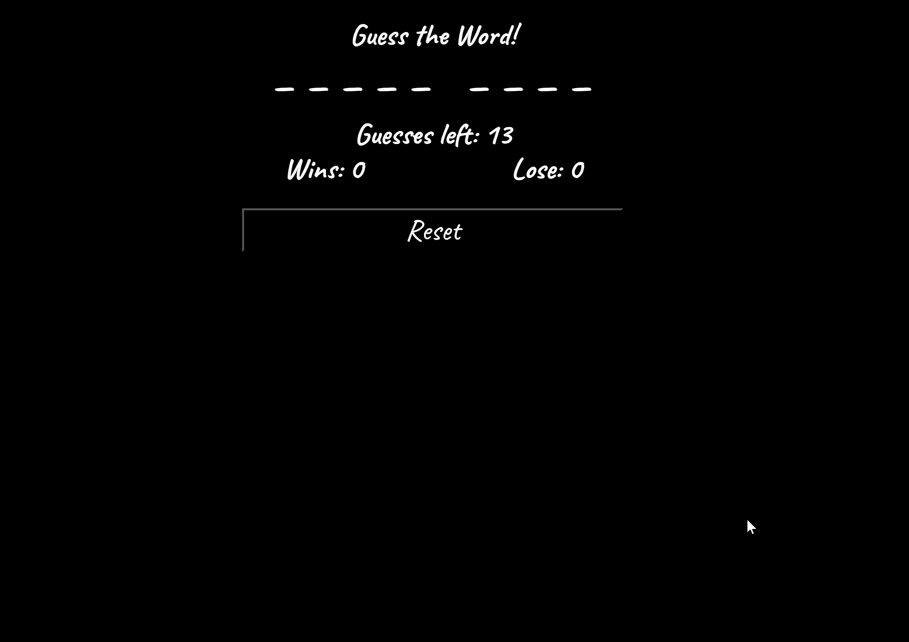

# word-guess-redo

Simple hangman game built with vanilla javascript. Try it <a href="https://bksaechao.github.io/word-guess-redo/">here</a>!

## Javascript Homework

This assignment challenged knowlege and application of javascript. The task was to create a word guess game using only javascript, html, & css.

## _(Follow up notes)_

Assignement was still quite challenging on my second attempt, but code is a lot cleaner. Design is nicer as well. Overall a tough, fun challenge!
